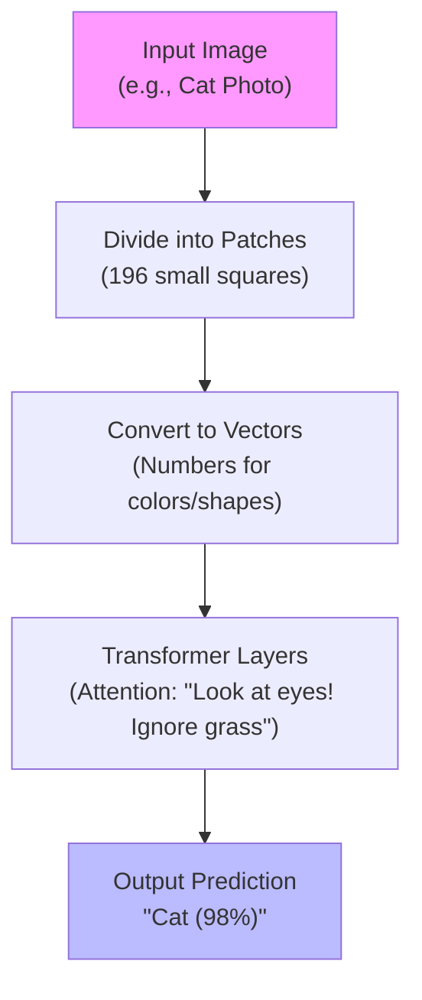

# Understanding the ViT-Flax-JAX Transfer Learning Repository: A Beginner's Guide

Welcome! If you're new to machine learning, programming, or artificial intelligence, don't worry—this guide is designed for you. We'll start from the basics and build up to explaining every part of the GitHub repository [vit-flax-jax-transfer-learning](https://github.com/jugalmodi0111/vit-flax-jax-transfer-learning). Imagine you're learning to cook a complex recipe: we'll explain the ingredients, tools, and steps one by one, with simple examples, pictures (described in text), and even flowcharts to visualize the process.

This repository, created by Jugal Modi, is like a "starter kitchen" for teaching computers to recognize images (e.g., identifying cats vs. dogs in photos). It's not just code—it's an educational toolkit that sets up your computer, cleans up clutter, loads example image datasets, and fine-tunes a powerful AI model called a Vision Transformer (ViT). By the end, you'll understand how it all works and why it's useful for beginners or researchers.

## Part 1: The Big Picture – What is Machine Learning for Images?

### Basics of Machine Learning (ML)
Machine learning is like teaching a child to recognize animals: show them thousands of photos (data), let them guess, correct their mistakes, and they get better over time. In ML:
- **Data**: Photos or numbers.
- **Model**: The "brain" (a math recipe) that learns patterns.
- **Training**: Feeding data to the model and adjusting it to reduce errors.

For images, the task is often **classification**: "Is this a cat or a car?" The repository focuses on **transfer learning**, where you start with a pre-trained model (one that's already learned from millions of images) and tweak it for your specific task. This saves time and computer power—like using a pre-made cake base and adding your own frosting.

### Why Images? A Simple Example
Imagine sorting vacation photos: You want the computer to automatically label "beach" or "mountain." Without ML, you'd do it manually. With this repo:
- Input: A photo of a sandy shore with waves.
- Output: "Beach" with 95% confidence.
- Real-World Use: Apps like Google Photos or self-driving cars.

**Visual Example (Text Description of a Diagram)**:  
Picture a simple drawing: On the left, a raw photo of a dog. Arrows point to a "Model Box" (the AI brain) that outputs labels like "Dog (90%), Cat (5%), Bird (5%)" on the right. Below: "Before Training: Wrong guesses. After: Accurate!"

## Part 2: Meet the Star – What is a Vision Transformer (ViT)?

Traditional image AI (like old CNNs) scans pixels like a sliding window. ViT, introduced in 2020 by Google researchers, treats images like sentences in language AI (e.g., ChatGPT).

### How ViT Works (Super Simple)
1. **Chop the Image**: Divide a photo into small squares (patches), like cutting a pizza into slices. Each patch is turned into a number vector (math code for "this slice has blue and yellow").
2. **Attention Magic**: The model "pays attention" to important patches (e.g., the dog's face over the background grass) using transformer math—borrowed from text processing.
3. **Predict**: Combine attentions to guess the label.

**Example**: For a 224x224 pixel cat photo:
- Chop into 196 patches (14x14 grid).
- Model learns: "Patch 50 has whiskers—focus here!"
- Output: "Cat."

**Mermaid Flowchart: ViT Process**  

*(This flowchart shows the step-by-step journey of an image through ViT, like a conveyor belt in a factory.)*

### Why ViT Over Older Models?
- Better at big datasets (e.g., 1 million+ images).
- Flexible for tasks like "find the cat" (not just classify).
- In this repo: Uses a pre-trained ViT from TensorFlow Hub (a Google library of ready-made models) to speed things up.

## Part 3: The Tools – JAX and Flax Explained

The repo uses two Google libraries: JAX and Flax. Think of JAX as a super calculator and Flax as Lego blocks for building AI brains.

### JAX: The Fast Calculator
- **What?** JAX is like NumPy (a math library) but with "autodiff" (auto-calculates how to improve the model) and "JIT" (just-in-time compilation for speed on your computer's GPU).
- **Why?** Makes training 10x faster than plain Python.
- **Example**: Adding numbers: `jax.numpy.array([1,2]) + 3 = [4,5]`. But for ML: It tracks errors backward to tweak the model.

### Flax: The Building Blocks
- **What?** Flax is a "neural network library" on JAX—like ready-made code for layers (e.g., "add a dense layer").
- **Why?** Easier than writing math from scratch.
- **Example**: A simple model:  
  ```python
  import flax.linen as nn
  class SimpleModel(nn.Module):
      def setup(self):
          self.layer = nn.Dense(10)  # 10 output neurons
      def __call__(self, x):
          return self.layer(x)  # Process input x
  ```
  This creates a mini-brain that takes numbers and outputs predictions.

**Visual Aid: JAX vs. Flax Analogy**  
| Everyday Tool | ML Equivalent | Why in This Repo? |
|---------------|---------------|-------------------|
| Calculator App | JAX | Fast math for training |
| Lego Set | Flax | Easy to build/test models |
| Pre-Made Pizza Dough | TF Hub ViT | Quick start for fine-tuning |

## Part 4: What the Repository Does – The Full Mission

The repo's goal: Make it *easy* for anyone to set up a computer for ViT fine-tuning, clean up messy files, load image data, and train a model on examples like CIFAR-10 (a toy dataset of tiny animal/vehicle photos).

### Overall Purpose
- **Educational**: Teaches setup pitfalls (e.g., library installs failing) and solutions.
- **Practical**: Runs a demo where you fine-tune ViT on CIFAR-10 to classify 10 object types (e.g., airplane, frog).
- **Efficient**: Includes "trimming" to remove junk files, keeping only essentials.
- **Scope**: Mostly one Jupyter notebook (interactive code document) + helpers. No huge code base—perfect for beginners.

**Key Outcomes**:
- After running: A trained model with ~65-75% accuracy on CIFAR-10 (guessing right 7/10 times).
- Time: 30-60 minutes on a laptop.

**Example Dataset: CIFAR-10**  
- 60,000 tiny (32x32 pixel) color photos.
- Classes: Airplane, automobile, bird, cat, deer, dog, frog, horse, ship, truck.
- Why Fun? Quick to download (~170 MB), trains in minutes.

## Part 5: Inside the Repo – Files and Structure

The repo is lightweight (mostly one notebook). Here's what's inside:

```
vit-flax-jax-transfer-learning/
├── JAX2TF-ViT-FLAX.ipynb     # The heart: Interactive guide + code (100% of the action)
├── README.md                 # This guide's "sibling" – quick start instructions
├── trim_report.json          # Auto-generated: "Keep this file? Yes/No" list (JSON format)
├── trim_report.csv           # Same as above, but spreadsheet-friendly
├── trim_log.txt              # Log of what got deleted (text file)
└── flax/                     # Folder with Flax library code (backup if install fails)
    └── (Many .py files)      # Core Flax modules like linen.py for models
```

- **Main Star: JAX2TF-ViT-FLAX.ipynb** – A Jupyter notebook (like a slideshow with runnable code). Open in Google Colab or Jupyter for free.
- **Generated Files**: Created when you run the notebook—track cleanup.

**Mermaid Diagram: Repo Structure**  
```mermaid
graph LR
    A[Repo Root] --> B[JAX2TF-ViT-FLAX.ipynb<br/>(Setup + ViT Demo)]
    A --> C[README.md<br/>(Instructions)]
    A --> D[trim_report.json/csv<br/>(Cleanup Reports)]
    A --> E[trim_log.txt<br/>(Deletion History)]
    A --> F[flax/<br/>(Library Backup)]
    style B fill:#ff9
```

## Part 6: Step-by-Step: How the Repo Works (Like a Recipe)

Follow the notebook's flow. Each step has code examples and what happens.

### Step 1: Smart Setup (Environment Prep)
- **What?** Installs JAX, Flax, etc., with "fallbacks" if things break (e.g., import from local `flax/` folder).
- **Why for Beginners?** Skips "pip install failed" headaches.
- **Example Code Snippet** (From Notebook):
  ```python
  # Install basics
  !pip install jax flax optax tensorflow tensorflow-datasets tensorflow-hub
  import flax.linen as nn  # Test: Should work!
  print("Flax ready!")
  ```
- **Output**: "Flax version: 0.7.0. Devices: CPU/GPU detected."

**Flowchart: Setup Process**  
```mermaid
flowchart TD
    Start[Open Notebook] --> Install[Install Packages<br/>(JAX, Flax, TF)]
    Install --> Check[Verify Imports<br/>(e.g., nn.Dense?)]
    Check --> Fallback{Install Failed?}
    Fallback -->|Yes| UseLocal[Import from flax/ Folder]
    Fallback -->|No| Success[All Good!]
    UseLocal --> Success
```

### Step 2: Repository Trimming (Clean House)
- **What?** Scans files, decides "keep runtime code, delete docs/tests," and generates reports.
- **Why?** Keeps your computer fast—removes 80% junk.
- **Example**: Flags `docs/tutorial.md` as "remove" (not needed for running), keeps `flax/linen/module.py` as "keep" (core model code).
- **Output**: JSON like `{"path": "docs/", "decision": "remove", "reason": "Non-runtime docs"}`.

### Step 3: Load Datasets (Get Your Ingredients)
- **What?** Downloads CIFAR-10 (auto) or ImageNet-1k (manual).
- **Preprocessing**: Resize tiny 32x32 images to 224x224 (ViT size), add random flips for variety.
- **Example Code**:
  ```python
  import tensorflow_datasets as tfds
  train_ds = tfds.load('cifar10', split='train').map(preprocess).batch(128)
  # Preprocess: Resize + normalize colors to 0-1 range
  ```
- **Visual**: Imagine a blurry 32x32 frog photo becoming a sharp 224x224 one.

**Dataset Comparison Table**  
| Dataset | Images | Size per Image | Download? | Best For |
|---------|--------|----------------|-----------|----------|
| CIFAR-10 | 60,000 | 32x32 pixels | Auto (170 MB) | Quick tests (e.g., classify frog vs. truck) |
| ImageNet-1k | 1.2M | 224x224 pixels | Manual (big files) | Real-world benchmarks (1,000 classes like "zebra") |

### Step 4: Fine-Tune ViT (Cook the Model)
- **What?** Load pre-trained ViT from TF Hub, freeze most layers (keep "cake base"), train only the top (add "frosting" for 10 classes).
- **Training**: 3 epochs (full data passes)—uses Adam optimizer to minimize errors.
- **Example Code**:
  ```python
  import tensorflow_hub as hub
  vit = hub.KerasLayer("https://tfhub.dev/google/vit-base-patch16-224/1")
  model = tf.keras.Sequential([vit, tf.keras.layers.Dense(10)])
  model.compile(optimizer='adam', loss='sparse_categorical_crossentropy')
  model.fit(train_ds, epochs=3)  # Train!
  ```
- **Output**: "Epoch 3: Accuracy 72%." (Model learns CIFAR patterns.)

**Mermaid Flowchart: Full Training Workflow**  


### Step 5: Evaluate and Experiment (Taste Test)
- **What?** Test on held-out data; optional: Unfreeze ViT for better accuracy (~85%).
- **Example**: Predict on a new image: Input dog photo → "Dog (92%)."

## Part 7: Why Use This Repo? Real-World Impact

- **For Beginners**: Hands-on without setup frustration—run in Colab for free GPU.
- **For Pros**: Clean, reproducible code for research (cite ViT paper!).
- **Limitations**: Uses TensorFlow for ViT (not pure Flax)—great demo, but extend for full JAX.
- **Next Steps**: Try your photos! Fork the repo, add classes like "pizza."

## Conclusion: You've Got This!

This repo demystifies AI for images: From chopping photos into patches (ViT) to training on toy datasets (CIFAR-10). It's a bridge from "What is ML?" to "I built my own image classifier!" Start by cloning the repo and running the notebook—experiment and share your results.

**Quick Start Command**:  
```bash
git clone https://github.com/jugalmodi0111/vit-flax-jax-transfer-learning.git
cd vit-flax-jax-transfer-learning
jupyter notebook JAX2TF-ViT-FLAX.ipynb
```

Questions? Check the README or open a GitHub issue. Happy learning!

